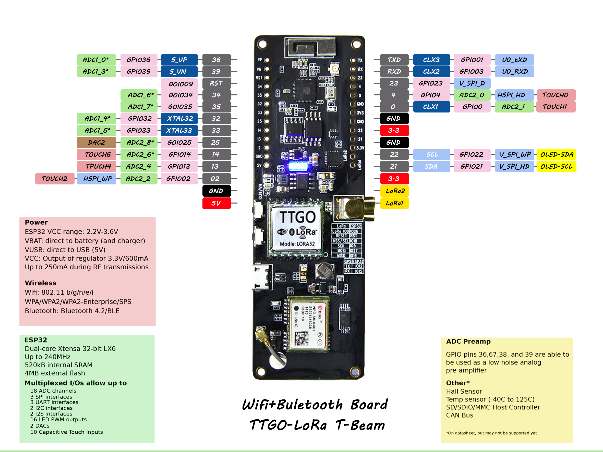
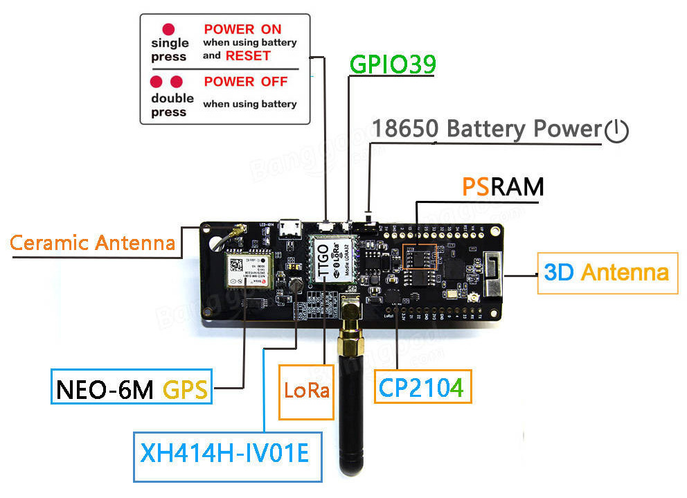
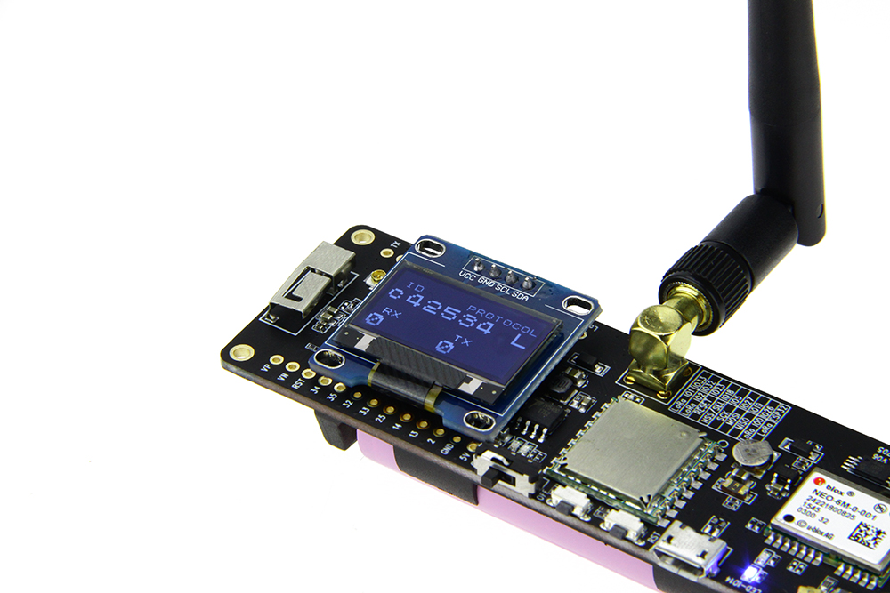
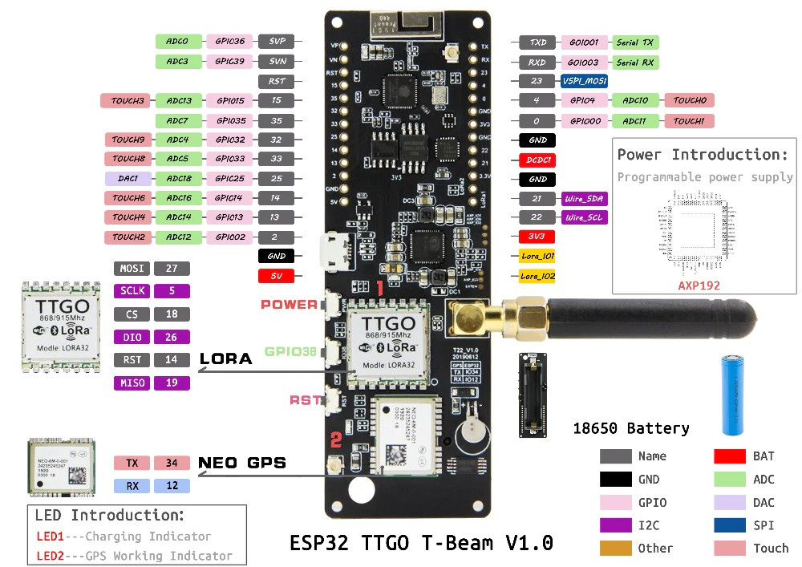
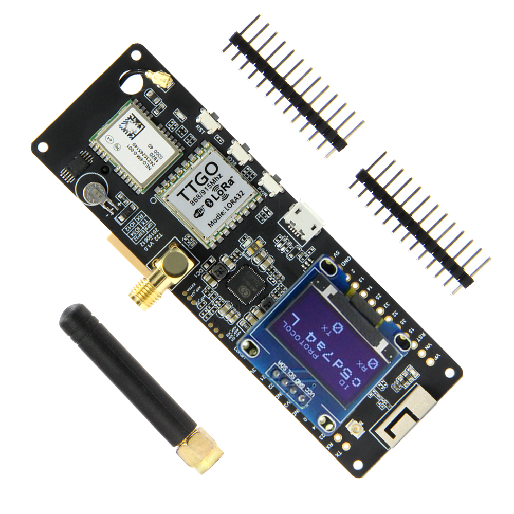

## Bushfire Early Warning IoT Device Using T-Beam

Based on TTGO T-Beam Tracker for The Things Network (1.2.3) by kizniche.

### Version 0.1 Update 27/09

Functionality added:
•	Time 
•	Continues to send after one (selected every 30s right now).
•	Will continue to send data after disconnecting when uploaded.
•	Flag whether the coordinates sending is valid (i.e., the hdop isnt so great that it's obvious there is no correct data).

Removed:
•	OTAA Functionality
•	Screen functionality
•	Changed the radio to false in configurations.
•	Probably some other stuff I can’t remember rn.
Lingering Questions:
•	Should be able to get rid of payload cayenne.
•	Does it send the last gps coordinate over and over again?
•	It sometimes transmits the wrong info, is it still doing this?
•	Validity of co-ordinates send only assessed at serial monitor, no flag raised at payload on ttn.


### Setup

The preferred method to install this library is via [PlatformIO](https://platformio.org/install), however the original instructions for installing with the Arduino IDE are below but YMMV.

1. Follow the directions at [espressif/arduino-esp32](https://github.com/espressif/arduino-esp32) to install the board to the Arduino IDE and use board 'T-Beam'.

2. Install the Arduino IDE libraries:

   * [mcci-catena/arduino-lmic](https://github.com/mcci-catena/arduino-lmic) (for Rev0 and Rev1)
   * [mikalhart/TinyGPSPlus](https://github.com/mikalhart/TinyGPSPlus) (for Rev0 and Rev1)
   * [ThingPulse/esp8266-oled-ssd1306](https://github.com/ThingPulse/esp8266-oled-ssd1306) (for Rev0 and Rev1)
   * [lewisxhe/AXP202X_Library](https://github.com/lewisxhe/AXP202X_Library) (for Rev1 only)

3. Edit ```arduino-lmic/project_config/lmic_project_config.h``` and uncomment the proper frequency for your region.

4. Also add this line ```#define hal_init LMICHAL_init``` so there isnt any clashes between libraries.

5. Create a TTN network key and update to ```credentials.h```

6. Add the TTN Mapper integration to your Application (and optionally the Data Storage integration if you want to access the GPS location information yourself or use [TTN Tracker](#ttn-tracker), then add the Decoder code:

```C
function Decoder(bytes, port) {
    var decoded = {};

    decoded.latitude = ((bytes[0]<<16)>>>0) + ((bytes[1]<<8)>>>0) + bytes[2];
    decoded.latitude = (decoded.latitude / 16777215.0 * 180) - 90;

    decoded.longitude = ((bytes[3]<<16)>>>0) + ((bytes[4]<<8)>>>0) + bytes[5];
    decoded.longitude = (decoded.longitude / 16777215.0 * 360) - 180;

    // HDOP scaled down to ensure small payload size
    decoded.hdop = bytes[6] / 10.0;
    
    decoded.sats = bytes[7];

    var timeBytes = bytes.slice(8, bytes.length);
    decoded.time = String.fromCharCode.apply(null, timeBytes).replace(/\0+$/, '');
    
    /* For finding bytes length received
    return {
      length: bytes.length,
      data: decoded
    }
    */
    
    return decoded
}
```

7. Open this project file ```main/main.ino``` with the Arduino IDE and upload it to your TTGO T-Beam.

8. Turn on the device and once a GPS lock is acquired, the device will start sending data to TTN and TTN Mapper.

### T-BEAM Diagrams

#### Rev0







#### Rev1




